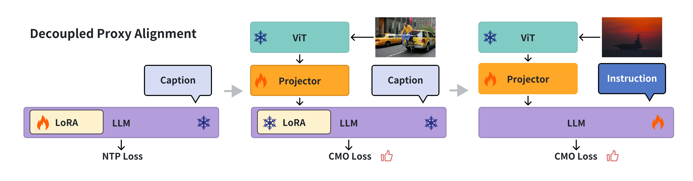

# Decoupled Proxy Alignment (DPA)

This repository contains the official implementation of our EMNLP 2025 paper:

**"Decoupled Proxy Alignment: Mitigating Language Prior Conflict for Multimodal Alignment in MLLMs"**

📄 **Paper**: [arXiv:2509.14735](https://arxiv.org/abs/2509.14735)

## 📖 Overview


*Figure 2: Illustration of Decoupled Proxy Alignment (DPA) - Three-stage training pipeline*

Multimodal large language models (MLLMs) suffer from **language prior conflict** - a mismatch between the inherent language priors of LLMs and those in training datasets. This conflict leads to suboptimal vision-language alignment as MLLMs adapt to training data language styles rather than focusing on multimodal understanding.

Our **Decoupled Proxy Alignment (DPA)** method addresses this issue through:

1. **Proxy Model Optimization (PMO)**: Uses a proxy LLM during pretraining to decouple vision-language alignment from language prior interference
2. **Contrastive Modality Optimization (CMO)**: Dynamically adjusts loss weights based on visual relevance to strengthen optimization for visually relevant tokens

## 🚀 Key Results

- **Dataset Quality Paradox**: High-quality datasets may hurt some models due to language prior conflicts
- **Consistent Improvements**: DPA significantly outperforms vanilla training and CAL across multiple model families (Qwen2.5, Llama-3.1, Gemma-2) and datasets (BLIP-LCS, ShareGPT4V-PT, PixMo-Cap)
- **Strong Generalization**: Excellent performance across different model scales (1.5B to 32B parameters) and data sizes

## 🛠️ Installation

### Environment Setup

```bash
git clone git@github.com:ShacklesLay/DPA.git
cd DPA

conda create -n dpa python=3.10 -y
conda activate dpa
pip install --upgrade pip
pip install -e ".[train]"
pip install flash-attn==2.5.7 --no-build-isolation
```

### Hardware Requirements

- **GPU**: 8x NVIDIA H100 GPUs (as used in our experiments)
- **Memory**: Sufficient GPU memory for training large models (recommend 80GB+ per GPU)
- **Storage**: Large storage capacity for datasets and model checkpoints

## 📊 Datasets

Our experiments use three main pretraining datasets:

1. **BLIP-LCS**: Filtered subset of LAION, CC, and SBU datasets (558K samples)
   - Source: [LLaVA Data](https://github.com/haotian-liu/LLaVA/blob/main/docs/Data.md)
2. **ShareGPT4V-PT**: High-quality GPT-4 generated captions 
   - Source: [ShareGPT4V Data](https://github.com/ShareGPT4Omni/ShareGPT4V/blob/master/docs/Data.md)
3. **PixMo-Cap**: Expert-annotated dataset from Molmo
   - Source: [PixMo-Cap Dataset](https://huggingface.co/datasets/allenai/pixmo-cap)

For instruction tuning, we use **Cambrian-1** dataset (737K samples):
- Source: [Cambrian-1 Dataset](https://huggingface.co/datasets/nyu-visionx/Cambrian-10M/blob/main/jsons/Cambrian737k.jsonl)

### Data Preparation

Please prepare your datasets in the following structure:
```
data/
├── LLaVA-Pretrain/
│   ├── blip_laion_cc_sbu_558k.json
│   ├── blip_laion_cc_sbu_558k_text_only.json
│   └── images/
├── ShareGPT4V-PT/
│   ├── share_gpt4v_instruct_gpt4-vision_cap_100k.json
│   └── images/
└── Cambrian-10M/
    ├── jsons/Cambrian737k.json
    └── images/
```

## 🔧 Usage

### Three-Stage Training Pipeline

DPA follows a three-stage training process:

#### Stage 1: Proxy LLM Pretraining
Train the LLM on text-only data to adapt to dataset language priors:

```bash
# Set your work directory
export WORK_DIR=/path/to/your/workspace

# Stage 1: Proxy LLM training
bash scripts/pretrain.sh
```

This stage:
- Uses LoRA (rank=256, alpha=512) to prevent catastrophic forgetting
- Trains only on caption text to learn dataset-specific language priors
- Outputs: `./checkpoints/llm/{model_name}-pretrain-lora_r256_alpha512-blip558k`

#### Stage 2: Proxy MLLM Pretraining  
Train multimodal connector with CMO using the proxy LLM:

```bash
# Stage 2: Proxy MLLM pretraining
bash scripts/pretrain_lvlm.sh
```

This stage:
- Integrates proxy LLM with vision encoder and connector
- Applies CMO with δ ∈ [0.05, 0.5] for dynamic token reweighting
- Trains only the connector layer while keeping LLM frozen
- Outputs: `./checkpoints/projectors/{run_name}/mm_projector.bin`

#### Stage 3: MLLM Instruction Tuning
Final tuning with original LLM and pretrained connector:

```bash
# Stage 3: MLLM instruction tuning  
bash scripts/finetune_lvlm.sh
```

This stage:
- Combines original LLM with pretrained connector
- Applies CMO during instruction tuning
- Trains both connector and LLM
- Outputs: `./checkpoints/finetune/{run_name}/`

### Key Hyperparameters

| Parameter | Stage 1 | Stage 2 | Stage 3 |
|-----------|---------|---------|---------|
| Learning Rate | 4e-5 | 2e-3 | 4e-5 |
| Batch Size | 256 | 256 | 256 |
| LoRA Rank | 256 | - | - |
| LoRA Alpha | 512 | - | - |
| δ_min (CMO) | - | 0.05 | 0.05 |
| δ_max (CMO) | - | 0.5 | 0.5 |

## 📋 Evaluation

### Supported Models
- Qwen2.5-7B-Instruct
- Llama-3.1-8B-Instruct  
- Gemma-2-9B-it
- And other model scales (1.5B, 3B, 14B, 32B)

### Evaluation Benchmarks

**General Benchmarks:**
- MMBench (commonsense reasoning)
- AI2D (diagram parsing) 
- DocVQA (document understanding)
- OCRBench (OCR capability)

**Vision-Centric Benchmarks:**
- CVBench (spatial relationship analysis)
- MMVP (fine-grained feature recognition)
- NaturalBench (comprehensive visual perception)

### Running Evaluation

For evaluation, we use different toolkits for different benchmarks:

- **MMVP and CVBench**: Use [Cambrian evaluation toolkit](https://github.com/cambrian-mllm/cambrian)
- **Other Benchmarks** (MMBench, AI2D, DocVQA, OCRBench, NaturalBench): Use [VLMEvalKit](https://github.com/open-compass/VLMEvalKit)

Please refer to the respective repositories for detailed evaluation instructions and setup.

## 🔬 Ablation Studies

The repository includes comprehensive ablation studies:

1. **Component Analysis**: PMO vs CMO vs DPA
2. **CMO Stage Analysis**: Pretraining vs Instruction Tuning
3. **Hyperparameter Studies**: LoRA rank, δ bounds
4. **Scale Studies**: Model size and data size effects

Run ablations by modifying the training scripts and comparing results.

## 📈 Results Summary

| Method | Qwen2.5-7B | Llama-3.1-8B | Gemma-2-9B |
|--------|------------|---------------|-------------|
| Vanilla | 49.0 | 47.0 | 48.2 |
| CAL | 51.0 | 46.0 | 47.4 |
| **DPA** | **51.7** | **49.9** | **50.0** |

*Average scores across all benchmarks on ShareGPT4V-PT dataset*

## 🤝 Citation

If you find this work useful, please cite our paper:

```bibtex
@misc{tan2025decoupledproxyalignmentmitigating,
      title={Decoupled Proxy Alignment: Mitigating Language Prior Conflict for Multimodal Alignment in MLLM}, 
      author={Chenkun Tan and Pengyu Wang and Shaojun Zhou and Botian Jiang and Zhaowei Li and Dong Zhang and Xinghao Wang and Yaqian Zhou and Xipeng Qiu},
      year={2025},
      eprint={2509.14735},
      archivePrefix={arXiv},
      primaryClass={cs.CL},
      url={https://arxiv.org/abs/2509.14735}, 
}
```

## 📝 License

This project is released under the Apache 2.0 license.

## 🙏 Acknowledgments

This work builds upon [LLaVA-NeXT](https://github.com/LLaVA-VL/LLaVA-NeXT/) and incorporates insights from multimodal alignment research. We thank the community for open-sourcing datasets and model implementations.

## 📞 Contact

For questions about this work, please:
- Open an issue in this repository
- Contact: [cktan25@m.fudan.edu.cn]

---
